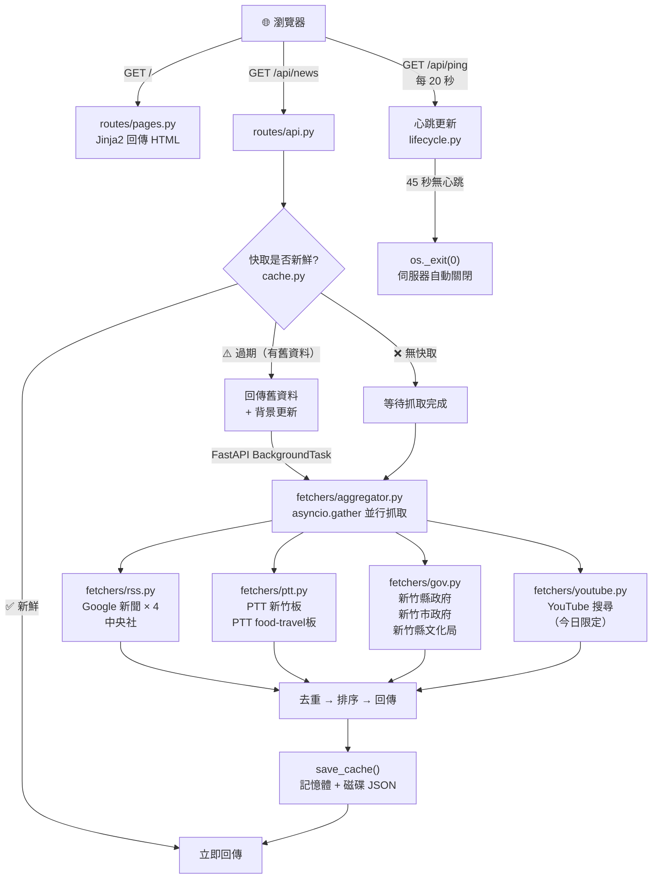

# 新竹每日大小事 🏙️

> 一鍵啟動的新竹在地新聞聚合器，整合新聞、美食、景點、娛樂、生活、YouTube 影片。

---

## 功能特色

- 聚合 8+ 個新竹在地新聞來源（Google 新聞、中央社、PTT、縣市政府、文化局、YouTube）
- 依分類篩選：新聞 / 美食 / 景點 / 娛樂 / 生活 / 影片
- 可查詢任意歷史日期的新聞
- 自動快取（當日 20 分鐘、歷史日期永久）
- 關閉瀏覽器頁面後伺服器自動結束

---

## 快速開始

### 需求
- Python 3.11+
- Windows（啟動腳本使用 `.bat`）

### 安裝與啟動

雙擊 `start.bat`，首次執行會自動安裝依賴套件並開啟瀏覽器。

或手動執行：

```bash
pip install -r requirements.txt
python main.py
```

瀏覽器開啟 → http://127.0.0.1:5000

---

## 專案架構

```
everyday_Hsinchu_FastAPI/
├── main.py                  # FastAPI app 入口、lifespan（啟動/關閉）
├── models.py                # Pydantic 資料模型（Article、NewsResponse）
├── utils.py                 # 工具函式（分類偵測、日期解析、HTML 清理）
├── cache.py                 # 雙層快取（記憶體 + 磁碟 JSON）
├── lifecycle.py             # Port 管理、自動開瀏覽器、心跳監控
│
├── routes/
│   ├── pages.py             # GET  /          → 回傳 HTML 頁面
│   └── api.py               # GET  /api/news  → 新聞 JSON API
│                            # GET/POST /api/ping → 心跳
│
├── fetchers/
│   ├── aggregator.py        # 並行整合所有來源（asyncio.gather）
│   ├── rss.py               # Google 新聞、中央社（RSS + httpx）
│   ├── ptt.py               # PTT 新竹板、food-travel板（httpx）
│   ├── gov.py               # 新竹縣市政府、文化局（httpx）
│   └── youtube.py           # YouTube 搜尋（youtube-search-python）
│
├── templates/
│   └── index.html           # 前端（Tailwind CSS + Vanilla JS）
│
├── requirements.txt
├── start.bat
└── .gitignore
```

---

## 架構流程圖



---

## API 說明

### `GET /api/news`

| 參數 | 預設值 | 說明 |
|------|--------|------|
| `date` | 今天 | 查詢日期，格式 `YYYY-MM-DD` |
| `category` | `all` | 分類篩選：`all` / `新聞` / `美食` / `景點` / `娛樂` / `生活` / `影片` |
| `force` | `0` | `1` = 強制略過快取重新抓取 |

**回應範例：**
```json
{
  "date": "2026-04-29",
  "total": 42,
  "from_cache": true,
  "articles": [
    {
      "title": "新竹...",
      "link": "https://...",
      "published": "2026-04-29 10:30",
      "source": "Google 新聞",
      "category": "新聞",
      "summary": "...",
      "image": "https://..."
    }
  ]
}
```

### `GET /POST /api/ping`

回傳 `{"status": "ok"}`，用於心跳保活。

---

## 快取機制

| 層級 | 儲存位置 | TTL |
|------|----------|-----|
| L1 記憶體 | `dict`（process 內） | 當日 20 分鐘，歷史永久 |
| L2 磁碟 | `cache/YYYY-MM-DD.json` | 同上 |

**Stale-While-Revalidate**：快取過期時立即回傳舊資料，同時在背景更新，使用者不會感受到等待。

---

## 新聞來源

| 來源 | 類型 | 分類 |
|------|------|------|
| Google 新聞（新竹） | RSS | 新聞 |
| Google 新聞（竹北市） | RSS | 新聞 |
| Google 新聞（竹科） | RSS | 新聞 |
| Google 新聞（美食） | RSS | 美食 |
| Google 新聞（景點） | RSS | 景點 |
| Google 新聞（娛樂） | RSS | 娛樂 |
| 中央社地方新聞 | RSS | 新聞 |
| PTT 新竹板 | 網頁爬蟲 | 生活 |
| PTT Food板（新竹關鍵字篩選） | 網頁爬蟲 | 美食 |
| PTT travel板（新竹關鍵字篩選） | 網頁爬蟲 | 景點 |
| 新竹縣政府 | RSS | 新聞 |
| 新竹市政府 | 網頁爬蟲 | 新聞 |
| 新竹縣文化局 | 網頁爬蟲 | 娛樂 |
| YouTube | 搜尋 API | 影片（今日限定） |

---

## 技術棧

| 項目 | 說明 |
|------|------|
| **FastAPI** | Web 框架 |
| **uvicorn** | ASGI 伺服器 |
| **httpx** | 非同步 HTTP 客戶端 |
| **feedparser** | RSS 解析 |
| **BeautifulSoup4** | HTML 爬蟲 |
| **youtube-search-python** | YouTube 搜尋 |
| **Pydantic v2** | 資料驗證與序列化 |
| **Tailwind CSS** | 前端樣式（CDN） |

---

## 注意事項

- `fetchers/gov.py` 對政府網站停用 SSL 驗證（`verify=False`），係因部分網站憑證設定問題。
- YouTube 來源僅在查詢**今日**時顯示，歷史日期不包含。
- 本專案為本機桌面工具，預設僅綁定 `127.0.0.1`，不對外開放。
